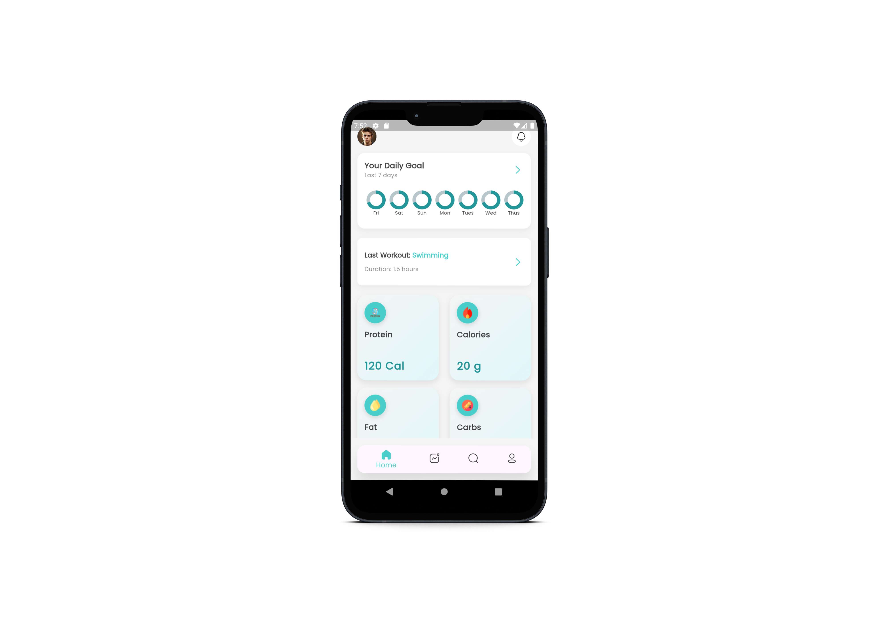

# Fitness Tracker App UI

A simple fitness tracker UI built using Flutter. The app's structure follows a clean architecture with separate folders for core logic, presentation, widgets, and screens.

## Preview


## Folder Structure

```bash
lib/
├── core/              # Core logic and utility functions
├── presentation/      # State management and business logic
├── widgets/           # Reusable UI components
├── screens/           # Main screens of the app
└── main.dart          # App entry point

